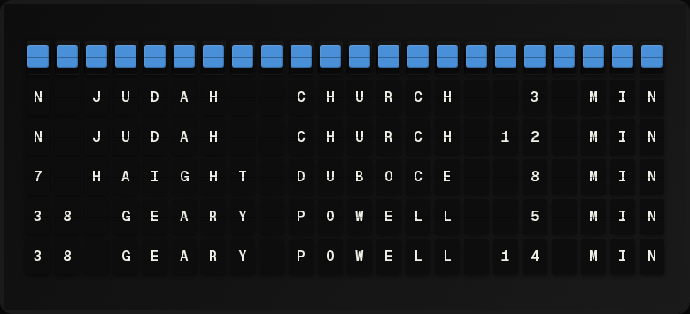

# SF Muni Plugin



Display San Francisco Muni transit arrival times with multi-stop and multi-line support.

**→ [Setup Guide](./docs/SETUP.md)** - API key registration and stop configuration

## Overview

The SF Muni plugin fetches real-time arrival predictions from 511.org and displays them for your selected stops. It supports multiple stops and shows arrivals for all lines at each stop.

## Features

- Real-time arrival predictions
- Multiple stop monitoring (up to 4)
- Multi-line support per stop
- Delay indicators
- Color-coded status

## Quick Setup

For detailed setup instructions including API key registration, see the **[Setup Guide](./docs/SETUP.md)**.

## Template Variables

### Primary Stop (First)

```
{{muni.stop_name}}     # Stop name
{{muni.stop_code}}     # Stop code
{{muni.line}}          # First line name
{{muni.formatted}}     # Pre-formatted arrivals
{{muni.is_delayed}}    # true/false
{{muni.stop_count}}    # Number of monitored stops
```

### Individual Stops (Array)

```
{{muni.stops.0.stop_name}}               # First stop name
{{muni.stops.0.stop_code}}               # First stop code
{{muni.stops.0.formatted}}               # All lines combined

{{muni.stops.0.all_lines.formatted}}     # Combined arrivals
{{muni.stops.0.all_lines.next_arrival}}  # Soonest arrival (minutes)
```

### Lines at Each Stop (Nested)

```
{{muni.stops.0.lines.N.formatted}}       # N-Judah arrivals
{{muni.stops.0.lines.N.next_arrival}}    # Next N train (minutes)
{{muni.stops.0.lines.N.is_delayed}}      # N line delay status

{{muni.stops.0.lines.J.formatted}}       # J-Church arrivals
{{muni.stops.0.lines.L.formatted}}       # L-Taraval arrivals
```

## Example Templates

### Single Stop

```
{center}MUNI
{{muni.stop_name}}
{{muni.formatted}}
```

### Multiple Stops

```
{center}MUNI ARRIVALS
{{muni.stops.0.formatted}}
{{muni.stops.1.formatted}}
{{muni.stops.2.formatted}}
```

### Specific Lines

```
{center}MUNI
N: {{muni.stops.0.lines.N.next_arrival}} min
J: {{muni.stops.0.lines.J.next_arrival}} min
L: {{muni.stops.0.lines.L.next_arrival}} min
```

### With Delay Indicator

```
{center}{{muni.stop_name}}
{{muni.formatted}}
{{#if muni.is_delayed}}DELAYS REPORTED{{/if}}
```

## Configuration

| Setting | Type | Required | Description |
|---------|------|----------|-------------|
| enabled | boolean | No | Enable/disable the plugin |
| api_key | string | Yes | 511.org API key |
| route | string | No | Narrows the stop picker to one route; does not filter the board |
| stop_codes | array | Yes | Muni stop codes (max 4), chosen in the stop picker |
| refresh_seconds | integer | No | Update interval (default: 60) |

## Choosing Stops

Stops are picked from a searchable list, not typed in by hand. The settings
form asks the plugin for the live 511.org catalog, so the list is whatever SF
Muni is running today.

1. Enter your 511.org API key and save — the catalog is fetched with your key,
   so the picker stays empty until there is one.
2. Optionally pick a **Route Filter** (for example `N — JUDAH`) to narrow the
   list to the stops on that line. Leave it empty to search all of Muni.
3. Search the **Stops** field by name ("church", "judah") and select up to four.
   Each option shows the stop name, its stop code, and — where San Francisco
   has named both kerbs of an intersection identically — which side of the
   street it is on:

   ```
   Church St & Duboce Ave
   Stop 15726 · north side

   Church St & Duboce Ave
   Stop 15727 · south side
   ```

The value saved is still the plain stop code, so configurations created before
the picker existed keep working untouched, and a known code can still be typed
in directly.

## Muni Lines

| Code | Name |
|------|------|
| N | N-Judah |
| J | J-Church |
| K | K-Ingleside |
| L | L-Taraval |
| M | M-Ocean View |
| T | T-Third |
| F | F-Market |

## Notes

- Uses regional transit cache to avoid API rate limits
- Cache refreshes every 90 seconds
- Arrivals shown in minutes until arrival

## Author

FiestaBoard Team

